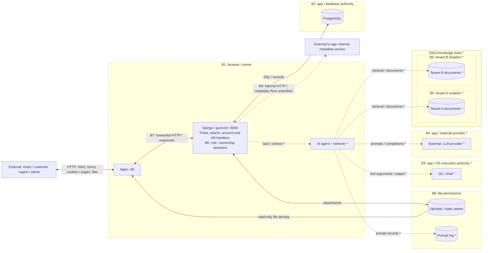

# Meridian Service Desk - Week 2 threat model

**Legend:** Rectangles = entities/processes; cylinders = stores. Dashed boxes mark trust boundaries; dotted arrows and `*` mark unverified flows/components. B6 is authorization within Django; B7 is proxy-header trust; B9 separates user-directed requests from internal-service authority. Containers share a network: boundaries do not imply network isolation. Only Nginx publishes a host port: `127.0.0.1:5001`.

**Ranked STRIDE register:** S: spoofing; T: tampering; R: repudiation; I: information disclosure; D: denial of service; E: elevation of privilege. Impact and likelihood range from 1 (low) to 5 (high); risk = impact × likelihood. Scores assume feature reachability; starred rows are conditional. "Unknown" means not checked.

| # | Element / boundary | STRIDE | Threat | Existing control / limitation | Impact×likelihood
|---|---|---|---|---|---|---|
| 1 | Search → DB, B2 | T/I | Input changes SQL; exposes accounts | Query binding unknown | 5×4=20 | Lab 1: SQL injection |
| 2 | Ticket ownership, B6 | E/I | Customer reads/edits another user's ticket | Roles documented; object checks unknown | 5×4=20 | Lab 5: access control |
| 3 | Agent → shell*, B3 | E | Model-directed tool executes unauthorized commands | Tool restrictions unknown | 5×3=15 | Lab 11: AI agency* |
| 4 | Browser → login, B1 | S | Attacker impersonates agent | Seeded passwords; throttling unknown | 4×3=12 | Authentication |
| 5 | Privileged action, B6 | E | Customer performs admin action | Roles documented; enforcement unknown | 4×3=12 | Access control |
| 6 | App → metadata, B9 | I | User-directed fetch exposes internal data | No host port; app can reach service | 4×3=12 | SSRF |
| 7 | App → uploads, B8 | T | Attachment overwrites another file | Nginx read-only mount; app checks unknown | 4×3=12 | File handling |
| 8 | Private media, B8/B6 | I | Unauthorized browser downloads attachment | Listing off; per-file authorization unknown | 4×3=12 | Access control / files |
| 9 | Retriever → tenants*, B5 | I | Retrieval leaks another tenant's documents | Tenant filtering unknown | 4×3=12 | RAG isolation* |
| 10 | Provider / prompt log*, B4/B8 | I | Sensitive ticket text leaks via prompts/logs | Redaction and log access unknown | 4×3=12 | AI data disclosure* |
| 11 | Submissions / generation*, B1/B4 | D | Repetition exhausts storage/compute/budget | Nginx 10 MB/request; quotas unknown | 3×4=12 | Resource consumption |
| 12 | Ticket / tool actions*, B6/B3 | R | Actor denies action without attributable evidence | Audit coverage/integrity unknown | 3×3=9 | Logging / monitoring |

**Priorities and controls.** Investigate #1 and #2 first for potentially broad account/ticket exposure, then #3 if shell tooling exists for application compromise. #1: **input handling**, parameterized queries at database calls, provisionally the cheapest effective high-impact control if affected calls are few; #2: **access control**, server-side ownership/role checks before every read/write, including media. #3: **architecture**, restricted tools and least-privilege execution isolation, with approval for consequential actions; input validation alone cannot establish user authority (#2) or constrain agent authority (#3).